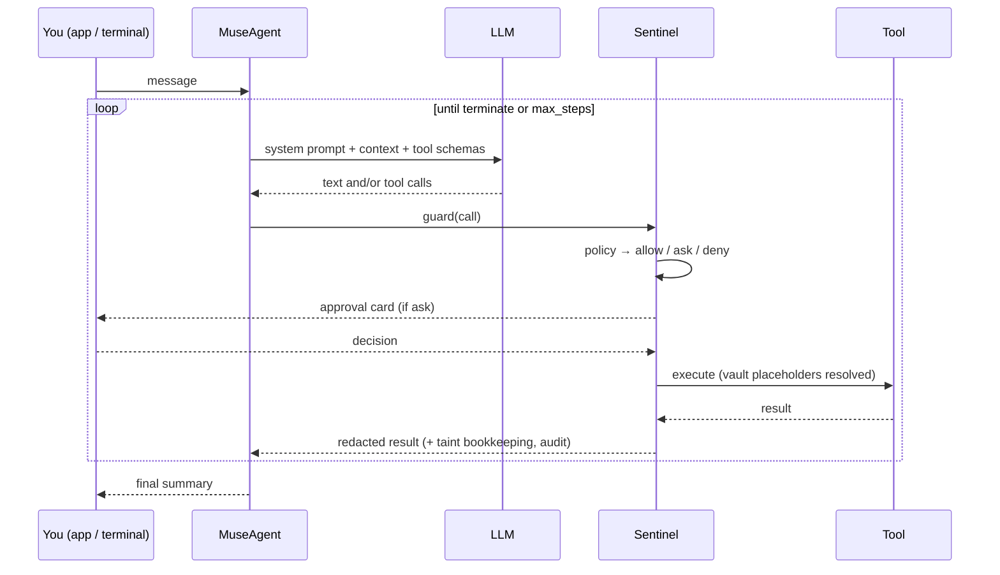

# 架构

这一页把行为对应到源文件。改智能体循环、加工具、碰任何和哨兵（Sentinel）有关的东西之前，先读一遍。

## 一轮对话 {#one-turn}



`MuseAgent.run()` 每轮只组装一次系统提示（档案、语言规则、相关的记忆、进行中的目标），然后进入循环：问模型，把每个工具调用交给 `Sentinel.guard()`，追加结果，等模型调用 `terminate` 或者不带工具直接回复时停下。一轮进行到一半时从 App 来的消息，会在下一次调用模型之前并进去。同一个调用反复出现又没有进展时，卡住检测会触发；`max_steps` 强制收尾。

## 源码地图 {#source-map}

| 区域 | 文件 | 说明 |
|---|---|---|
| 组合根 | `nanomuse/app.py` | `NanoMuseApp` 把设置接到 LLM、工具、保险库、哨兵、记忆、目标、智能体上 |
| 智能体循环 | `nanomuse/agent/core.py` | 组装提示、裁剪上下文、卡住检测、会话持久化、收件箱 |
| 提示 | `nanomuse/prompts.py` | 系统提示、语言规则和文字系统检测、推进目标的提示 |
| 哨兵 | `nanomuse/sentinel/gate.py`、`policy.py`、`audit.py` | 守卫、决策顺序、审批、污点、保险库解析、脱敏、JSONL 审计 |
| 保险库 | `nanomuse/vault/vault.py` | Fernet 存储，`{{vault:NAME}}` 占位符 |
| 工具基类 | `nanomuse/tools/base.py` | `BaseTool`、`CallAssessment`、`ToolCollection`、`safe_execute` |
| 内置工具 | `nanomuse/tools/files.py`、`shell.py`、`web.py`、`email_tool.py`、`browser.py` + `browser_backends.py`（服务器上的 Playwright，或手机的 WebView——见 [browser.md](browser.md)）、`memory_tools.py`、`goal_tools.py`、`terminate.py` | |
| MCP | `nanomuse/tools/mcp_tools.py` | stdio / streamable HTTP / SSE 客户端，每个远端工具对应一个 `MCPTool`；按工具覆盖风险的设置在 `MCPServerSettings.tools` |
| 在手机上 | `nanomuse/runtime.py`、`nanomuse/bridge/` | `device()` 读 `NANOMUSE_DEVICE*`；`DEVICE_TOOLS`（手机那些工具在哨兵里的默认值）和 `device_mcp_server()`（App 的 MCP 服务器作为 `device` 条目，工具名 `device__*`）；CLI 桥（`/api/bridge/*`，一次一条命令的令牌），背后是 `nanomuse-device` / `nanomuse-browser` / `nanomuse-open`——见 [device.md](device.md)、[local-runtime.md](local-runtime.md) |
| 手机 | `nanomuse/phone/link.py`、`screen.py`、`operator.py`、`trace.py`、`nanomuse/tools/phone.py` | 已连接的设备，以及经 App 的 WebSocket 走的请求/响应；屏幕是一张截图加一段说明文字；操作器循环（MemGUI 的 `mobile_use` 方言，坐标落在 999 网格上），用它自己的模型；JSONL 轨迹和它的 HTML 渲染；`phone_screen` / `phone_act` / `phone_task` 和它们在哨兵里的评估（见 [gui.md](gui.md)） |
| LLM | `nanomuse/llm/base.py`、`openai_chat.py`、`openai_responses.py`、`prompt_tools.py`、`factory.py`、`mock.py`；`catalogue.py` + `providers.json`、`chatgpt.py`、`codex.py`、`chatgpt_proxy.py` | `BaseLLM`、带 `<think>` 过滤的流式输出、重试、基于提示的工具调用、给测试用的 `MockLLM`；服务商目录（谁覆盖对话、视觉、图像、视频）；ChatGPT 登录（PKCE、令牌存储）以及 `provider = "chatgpt"` 和 `nanomuse chatgpt proxy` 背后 Chat Completions ↔ Codex Responses 的转换 |
| 记忆、目标 | `nanomuse/memory/store.py`、`nanomuse/memory/consolidate.py`、`nanomuse/goals/store.py` | SQLite；注入记忆时按罕见词（IDF）排序；整理计划器和它的检查；带撤销的变更日志 |
| App 服务器 | `nanomuse/server/service.py`、`api.py`、`webui.py`、`events.py` | 线程和工作任务、REST + WebSocket、把回调变成事件的 `UI` 实现、时间线持久化 |
| 前端 | `web/src/` | React + TypeScript + Tailwind；`store.tsx`（状态、WebSocket）、`screens/`（各个标签页）、`components/`（卡片、形象、Markdown） |
| 终端 | `nanomuse/console.py`、`nanomuse/cli.py` | 基于 Rich 的控制台界面，审批就在行内；Typer 命令 |
| 配置、结构 | `nanomuse/config.py`、`nanomuse/schema.py` | Pydantic 设置、消息和工具调用的模型 |

## `UI` 协议 {#the-ui-protocol}

任何能把智能体展示给人的东西，都实现 `nanomuse/ui.py::UI`：文字增量、助手消息、工具调用和结果、哨兵通知、`ask_approval()` 和 `ask_user()`。`ConsoleUI` 是终端；`WebUI` 把同样的回调变成时间线事件和 WebSocket 消息，并把审批放在 future 里等 App 回答。一个 Telegram 或桌面前端，就是这同一个协议的另一个实现，或者 HTTP API 的一个客户端。

## App 里的线程 {#threads-in-the-app}

`MuseService` 为每个线程保留一个 `MuseAgent`，各有自己的对话和工作任务，共用记忆和目标的存储、保险库和审计日志。主线程是那条长对话；旁聊是各自独立的线程；后台的目标检查在自己的线程里跑，把摘要发到主线程。一个 `contextvar` 告诉 `WebUI` 某个回调属于哪个线程。

## 扩展点 {#extension-points}

| 想加…… | 这样做 |
|---|---|
| 一个工具 | 在 `nanomuse/tools/` 里继承 `BaseTool`，设好 `risk`，如果某次调用可能比默认更危险就覆盖 `assess()`，在 `app.py::_build_tools` 里注册，用 `MockLLM` 加一个测试 |
| 一个连接器 | 优先用 MCP 服务器（`[[mcp.servers]]`）；只有协议装不进去时才写工具 |
| 一个模型服务商 | 大多数端点 `openai` / `openai_responses` 已经覆盖；否则实现 `BaseLLM`，在 `llm/factory.py` 里注册 |
| 一个前端 | 实现 `UI`，或者按 `docs/app.md` 驱动 HTTP/WebSocket API |
| 一种哨兵行为 | 决策改 `policy.py`，执行前后发生的事改 `gate.py` |

## 测试 {#tests}

```bash
python -m pytest -q                 # unit tests with MockLLM, no network
NANOMUSE_LIVE=1 python -m pytest -q -m live    # smoke test against your configured model
ruff check nanomuse tests && ruff format --check nanomuse tests
cd web && npm run build             # type-checks and rebuilds the app
```

`tests/test_server.py` 用一个写好脚本的 `MockLLM` 把 App 服务器从头到尾跑一遍：发消息、审批卡片、提问、目标、记忆、文件、设置。
